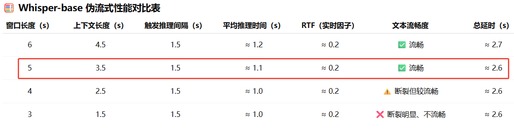
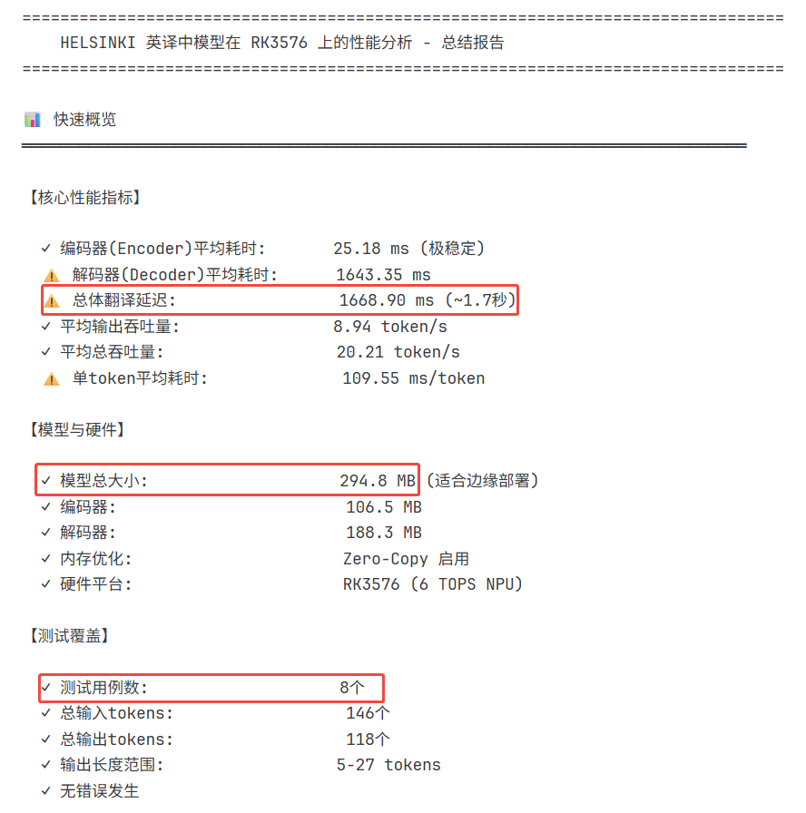
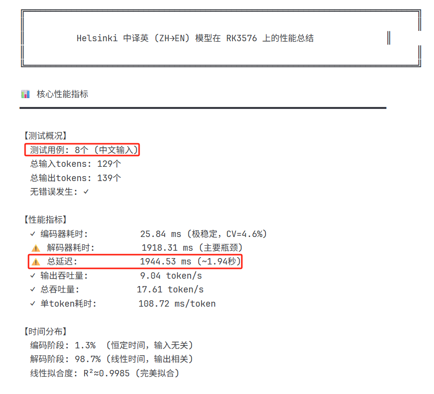
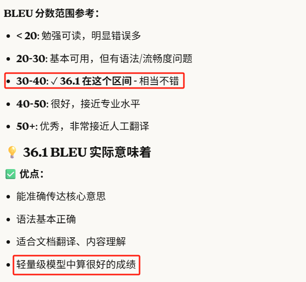

# Local-multilingual-real-time-speech-recognition-and-real-time-subtitle-translation
在端侧（RKxxxx、MTKxxx等系列芯片）Android设备上实现多语言本地实时语音识别与翻译、采用的主要模型是 ASR: whisper  Translate: Helsinki

1 在RK芯片上移植算法流程

（1） 先在python环境下，分别导出对应的onnx格式的 encoder和decoder（导出的时候注意和RK平台的适配，避免动态shape） 

（2） 在Python环境下用导出的onnx格式的encoder和decoder进行协同工作，测试完成编码器和解码器的协同工作，验证导出的模型的可用性 

（3） 验证完第二步之后，再继续在linux机器的python环境下，完成encoder.onnx和decoder.onnx 格式到rknn格式的转换 

（4） 根据XXXX模型的官方python推理代码、复刻编写Android环境下的C++推理代码。

    用输入的简单测试token完成XXXX模型(encoder.rknn和decoder.rknn)在RKXXX芯片上的协同推理工作（编码+解码），验证rknn格式模型以及C++版推理代码的可用性 

（5） 实现tokenizer，C++端实现tokenizer

    根据导出的vocab.txt，实现词表的映射，测试encoder能够正常工作，测试decoder能否正常工作，完成完整的C++端推理流程

whisper-base-6s性能测试报告

whisper-base-6s 平均推理延时

1 实时性：基本能满足实时ASR的要求，总体延时（等待+推理  从说话开始到输出整个ASR结果）可以做到1.5s左右

2 准确性：英文测下来，效果比较好，准确率比较高，其他语言准确率稍差一点， WERs (word error rates) or CER (character error rates, shown in Italic) 具体可以参考
https://github.com/openai/whisper

3 目前最佳配置：
滑动窗口 6s  上下文4s  推理触发时间2s

4 运行内存占用 300M,较小也比较合理，可以正常运行

Helsinki在RK3576上的性能测试报告

1 实时性

en-zh(英译中)

zh-en(中译英)

2 准确性（benchMark）

benchMark得分信息

分数说明
 
 

3 内存占用：300M左右，满足运行要求

4 结论：短文本（5-6个词）延时比较低500ms左右，可以满足实时翻译要求，中文本（6-10个词 ）延时1200ms，长文本（10个词以上 ）延时2000+ms，暂不不满足实时要求，准确性良好，满足要求

